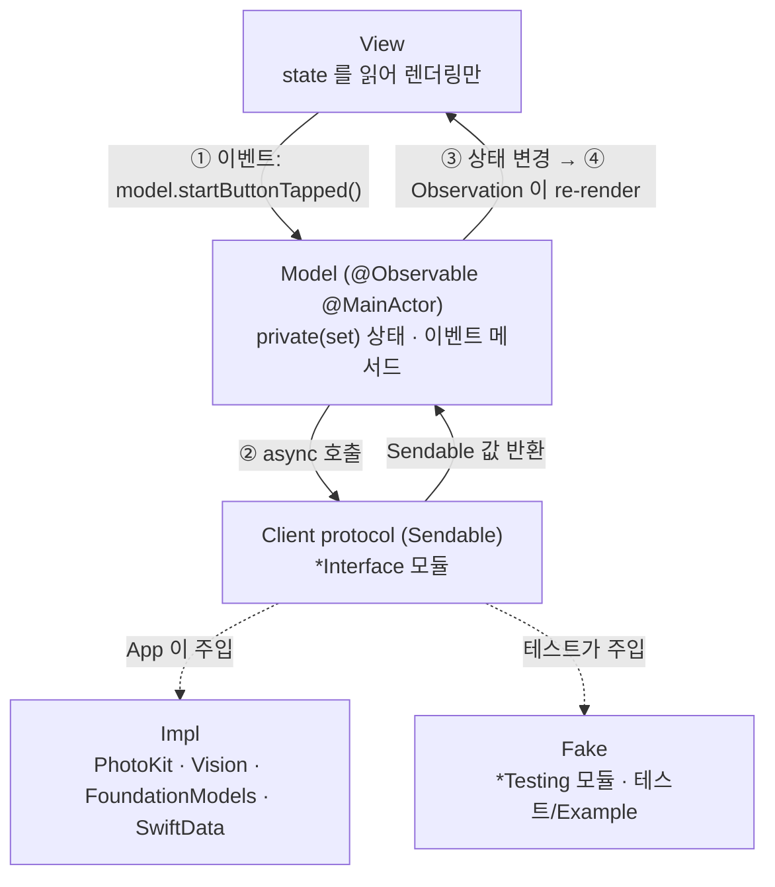
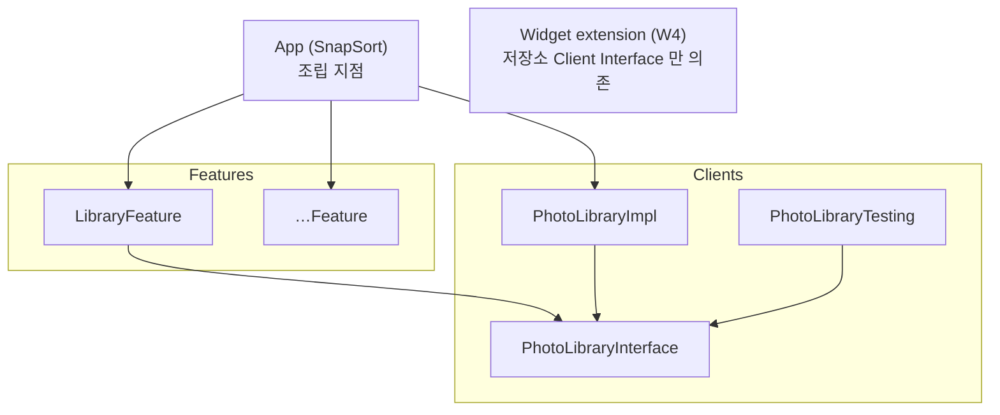

# 아키텍처

두 가지 결정 위에 서 있다.

1. **규칙 기반 단방향 MV.** SwiftUI 의 `@Observable` 모델을 View 에 직접 연결한다(Apple 샘플과 같은 방식). 단방향 흐름은 프레임워크가 아니라 규칙과 lint 로 강제한다.
2. **모듈러 아키텍처.** 외부 시스템은 Client 모듈로 감싸고, 각 Client 를 Interface / Impl / Testing 으로 나눈다. Feature 는 Interface 에만 의존한다.

## 1. 실행 흐름



### 단방향 규칙
| # | 규칙 | lint 로 강제 |
|---|---|---|
| 1 | Model 의 상태 프로퍼티는 모두 `public private(set) var` | 리뷰 |
| 2 | View 는 Model 의 **이벤트 메서드**만 호출한다. 이름은 "무슨 일이 일어났는가"로 짓는다: `onAppear()`, `startButtonTapped()`, `queryChanged(_:)` | 리뷰 |
| 3 | 입력 컨트롤은 `Binding(get: { model.query }, set: { model.queryChanged($0) })` 으로 연결한다. `$model.query` 금지 | `no_two_way_model_binding` |
| 4 | 부수효과(권한, OCR, 저장, 알림)는 Model 메서드 안에서 Client 를 통해서만 실행한다. View 에서 `Task { PHPhotoLibrary… }` 금지 | `system_framework_only_in_impl` |
| 5 | Model 은 `@MainActor`, Client 가 주고받는 값은 `Sendable`. `PHAsset` 같은 비 Sendable 객체는 식별자로 바꿔서 넘긴다 | 컴파일러 (Swift 6 strict) |
| 6 | Model 끼리 직접 참조하지 않는다. 화면 간 흐름은 App 이 조립하거나 공유 Client 를 거친다 | 모듈 경계 |
| 7 | Model 은 App(또는 Example 앱)이 `@State` 로 **소유**하고, View 는 `let model: XxxModel` 로 **참조**만 한다. View 안에서 Model 을 생성하거나 `@State` 로 다시 감싸지 않는다 | 리뷰 |
| 8 | View 전용 일시 상태(애니메이션, 포커스, 시트 표시 여부)는 View 의 `@State private var` 로 둬도 된다. 비즈니스 의미가 있으면 Model 로 옮긴다 | 리뷰 |

### 예시 (OnboardingFeature)
```swift
@MainActor
@Observable
public final class OnboardingModel {
  public private(set) var access: PhotoAccessState

  @ObservationIgnored private let photoLibrary: any PhotoLibraryClient

  public func startButtonTapped() async {
    self.access = await self.photoLibrary.requestAccess()
  }
}

// View
Button("정리 시작하기") { Task { await self.model.startButtonTapped() } }

// App: 화면 간 흐름은 App 이 정한다 (규칙 6)
if self.onboardingModel.access.canRead {
  LibraryView(model: self.libraryModel)
} else {
  OnboardingView(model: self.onboardingModel)
}
```

## 2. 모듈 구조



### 모듈 종류와 타깃
| 종류 | 위치 | 타깃 | 역할 |
|---|---|---|---|
| App | `Projects/App` | `SnapSort` | 유일한 조립 지점. Impl 을 생성해 Model 에 주입 |
| Feature | `Projects/Features/<Name>` | `<Name>Feature` · `<Name>FeatureTests` · `<Name>FeatureExample` | 화면 하나 또는 흐름 하나. Model + View |
| Client | `Projects/Clients/<Name>` | `<Name>Interface` · `<Name>Impl` · `<Name>Testing` · `<Name>Tests` | 외부 시스템 경계 |
| Shared (예정) | `Projects/Shared/<Name>` | `Core`(W2), `DesignSystem`(W4) | 도메인 모델, 공용 UI |

- **Interface**: 프로토콜과 값 타입(`PhotoAccessState` 등)만. Apple 데이터 프레임워크와 CoreLocation·MapKit 을 import 하지 않는다(CoreLocation·MapKit 은 lint 추가 전까지 리뷰 기준).
- **Impl**: 프로토콜 구현. 구현 타입 이름은 `<Name>ClientImpl`. Apple 데이터 프레임워크(Photos·Vision·FoundationModels·SwiftData·StoreKit·UserNotifications) import 는 여기서만. 예외: Feature View 의 MapKit `Map` 렌더링(§4).
- **Testing**: `<Name>ClientFake`. 고정 값을 돌려주는 `struct` 로 시작하고, 호출 기록이 필요해지면 그때 확장한다.
- **Example**: Fake 로 Feature 를 단독 실행하는 데모 앱. **`#Preview` 도 여기에 둔다** (Feature 모듈이 Testing 에 의존하지 않도록).

### 의존 규칙
| from ↓ / to → | Feature | Interface | Impl | Testing |
|---|---|---|---|---|
| App | ✅ | ✅ | ✅ | ❌ |
| Feature | ❌ | ✅ | ❌ | ❌ |
| Feature Tests / Example | 자기 Feature | ✅ | ❌ | ✅ |
| Client Impl | ❌ | 자기 Interface (+ 다른 Interface) | ❌ | ❌ |
| Client Tests | ❌ | ✅ | 자기 Impl | 자기 Testing |

### 빌드 설정
- 모든 모듈은 static framework. iPhone 전용, iOS 26.0+, Swift 6 언어 모드, `SWIFT_STRICT_CONCURRENCY=complete`.
- 설정은 `Tuist/ProjectDescriptionHelpers/Project+Templates.swift` 의 `Env` 에서만 바꾼다. 개별 매니페스트에서 덮어쓰지 않는다.

## 3. 모듈 추가 방법

### Client 추가 (예: ImageAnalysis)
1. `Tuist/ProjectDescriptionHelpers/Module.swift` 의 `Client` 에 `case imageAnalysis = "ImageAnalysis"` 추가.
2. 디렉터리 생성: `Projects/Clients/ImageAnalysis/{Interface,Impl,Testing,Tests}` + `Project.swift`:
   ```swift
   import ProjectDescription
   import ProjectDescriptionHelpers

   let project = Project.client(.imageAnalysis)
   ```
3. Interface 에 `public protocol ImageAnalysisClient: Sendable` 과 입출력 값 타입, Impl 에 `ImageAnalysisClientImpl`, Testing 에 `ImageAnalysisClientFake`, Tests 에 Impl 의 순수 로직 테스트.
4. 사용하는 Feature 매니페스트의 `clients:` 에 추가하고, App 매니페스트에 `.client(impl: .imageAnalysis)` 추가.
5. `make generate && make test`.

### Feature 추가 (예: Onboarding)
1. `Feature` 에 `case onboarding = "Onboarding"` 추가.
2. `Projects/Features/Onboarding/{Sources,Tests,Example}` + `Project.swift`:
   ```swift
   let project = Project.feature(.onboarding, clients: [.photoLibrary])
   ```
3. `Sources` 에 `OnboardingModel`, `OnboardingView`. `Tests` 에 Model 테스트. `Example` 에 `@main` 데모 앱과 `#Preview`.
4. App 매니페스트 dependencies 에 `.feature(.onboarding)` 추가, `SnapSortApp` 에서 Model 을 만들어 연결.

## 4. 확정된 기술 결정
| 결정 | 이유 |
|---|---|
| 서버 없음 | "사진이 밖으로 나가지 않는다"가 제품 가치. StoreKit 2 는 기기에서 영수증 검증 |
| 위치·지도는 Apple 시스템 서비스 | 장소 이름 변환은 MapKit `MKReverseGeocodingRequest`(`CLGeocoder` 는 iOS 26 에서 deprecated. 요청 수 제한이 있으므로 사진마다가 아니라 위치 묶음마다), 지도 핀은 MapKit `Map`. 모듈 경계: ① Feature View 는 `Map` 렌더링만을 위해 MapKit 을 import 할 수 있다 ② 지오코딩과 지도 앱 열기는 부수효과이므로 Client Impl 에서 한다 ③ Interface 의 좌표는 자체 `Sendable` 값 타입으로 둔다(`CLLocationCoordinate2D` 노출 금지). lint 규칙 추가 여부는 구현 PR 에서 정한다. 이때 **위치 좌표만** Apple 로 가고 사진과 OCR 텍스트는 보내지 않는다. OCR 로 읽은 주소를 지도 앱으로 넘기는 것은 사용자가 누를 때만. 개인정보 처리방침에 명시한다. 지오코딩 요청 원칙: ① 사용자가 장소가 필요한 화면(여행 폴더, 지역별 묶음, 지도)을 열 때만 요청하고 결과는 기기에 캐시한다. 백그라운드 일괄 지오코딩 금지 ② 생활권 묶음은 지오코딩하지 않는다("생활권"으로 표시) ③ 보내는 좌표는 묶음 중심점을 소수점 2자리(약 1km)로 반올림한 값. 구체적인 수치는 구현 PR 에서 조정할 수 있다 |
| 분류 대상 | 보관함의 모든 이미지(영상 제외). 스크린샷 여부(`.photoScreenshot`)는 조회 필터가 아니라 분류 신호로 쓴다 |
| 분류 3단 파이프라인 | ① 메타데이터(스크린샷 여부·위치·날짜·크기, 픽셀을 읽지 않음) → ② Vision 이미지 분류(`VNClassifyImageRequest`) 라벨 → ③ 스크린샷, 문서 계열 라벨, 카메라 촬영 정보(EXIF)가 없는 저장 이미지(앨범에 저장한 기프티콘·쿠폰 등)만 OCR·바코드 인식(`VNDetectBarcodesRequest`) + 키워드 규칙. 정확한 대상 조건은 OCR 파이프라인 작업에서 픽스처(저장한 기프티콘 포함)로 확정한다. ①~③은 모든 기기에서 동작하고, Foundation Models 는 ③의 텍스트 해석(기프티콘 브랜드·만료일 등)에만 `SystemLanguageModel.default.availability == .available` 인 기기에서 쓴다 |
| 분석 이미지 크기 | 이미지 분류·유사 이미지는 썸네일로, OCR·바코드는 기기에 있는 가장 큰 버전으로 분석한다. 어느 경우든 `isNetworkAccessAllowed = false` 로 iCloud 원본을 내려받지 않는다. 크기 기준은 OCR 파이프라인 작업에서 측정해 확정한다 |
| 카테고리 | 정보형(기프티콘·영수증·대화 캡처·쇼핑·지도·문서/메모), 사진형(여행·음식·인물·반려동물·풍경), 기타. 한 이미지가 여러 카테고리에 속할 수 있다 |
| 여행 판정 | 이미지 라벨이 아니라 위치·날짜로 판단한다. 생활권(촬영 위치가 가장 많이 모인 곳)에서 먼 곳의 사진이 연속된 날짜에 모여 있으면 여행으로 묶는다. 제한 접근(`.limited`)이면 사용자가 고른 사진만으로 판정하고, 정확도가 낮을 수 있다고 화면에 안내한다 |
| 저장소 | SwiftData, App Group 컨테이너 (위젯과 공유) — W2 에서 Client 로 추가 |
| 만료 알림 | `UNCalendarNotificationTrigger` 로컬 알림 — 서버 푸시 없음 |
| TCA 등 외부 아키텍처 라이브러리 | 사용하지 않음. 외부 의존성 0 을 유지하고, 추가하려면 사전 합의 |
